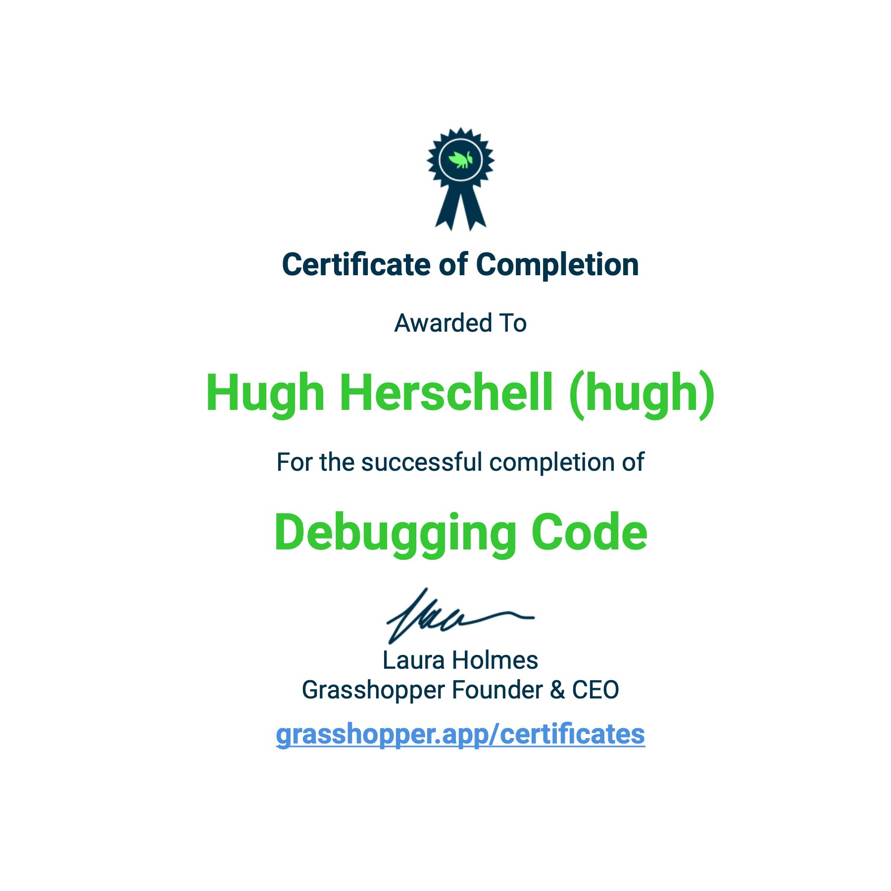
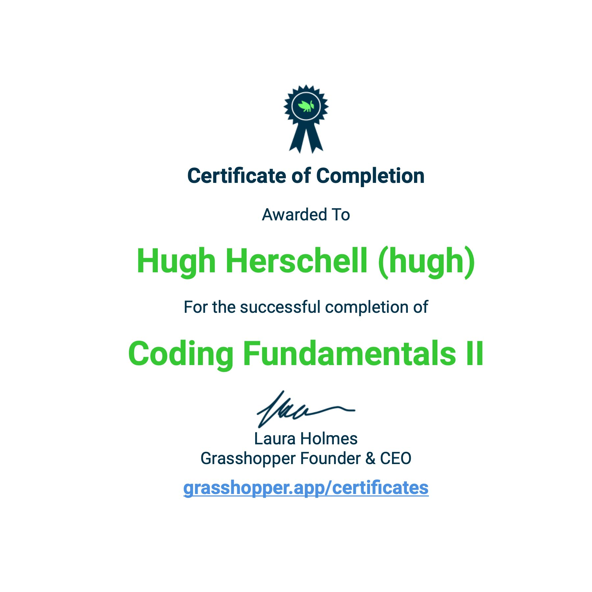

<h1 align="center">Hi 👋, I'm Hugh Herschell</h1>
<h3 align="center">A passionate fullstack developer from Kenya.</h3>

  

  

Total time coded since October 6 2022 
 

- 🔭 I’m currently working on **Mindstream Social**
  - Time spent on project | WakaTime
    

- 🌱 I’m currently learning **AI**

- 📫 How to reach me **hughherschell2018@gmail.com**

- 📄 Know about my experiences [https://novacoax.github.io/magpie](https://novacoax.github.io/magpie)

- ⚡ Fun fact **I also take photos.**

<h3 align="left">Connect with me:</h3>

<h3 align="left">Languages and Tools:</h3>

  
  
  
  
   
   
   
  
  
  
  
  
  
  
  
  

<h3 align="left">Support:</h3>

    

<h3 align="left">Achievements:</h3>

  
  

 
 
 

  
    
  

